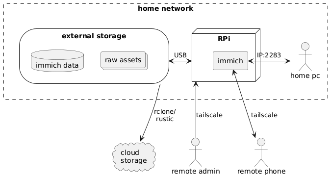

# immich-rpi-server
> A NixOS based Immich server on Raspberry Pi

This project aims to provide a cheap and simple way to set up and run an [Immich](https://immich.app/) instance, empowering you to move away from BigTech without needing a computer degree. Having said that, you will be running your own server which will require understanding of some basic concepts. I attempt to provide sufficient documentation and explanations to help you on your way to regain sovereignty over your personal data.

The specific setup descried protects against the following treats.
- Remote internet access of server and data: Requires small overhead [maintaining OS updates](#os-updates).
- Access from local network: Requires setting strong passwords.
- Physical access to external storage and RPi SD card: Requires [encryption of external drive](#1-encrypt-external-drive).

You may make modifications to some aspects of this setup if your treat model is different. For example, if physical access to the device is not a concern and you want the convenience of automatic setup on boot, you may choose to not encrypt the external drive.

> [!CAUTION]
> You will be taking back control of your media assets. You will be solely responsible for keeping them safe and accessible. This process requires a number of credentials to be created, without which no one, including yourself, can get access to this data.
> 
> Ensure that these credentials are stored securely. All instances where important credentials are create contain a similar `Caution` note. The following is a summary of all the necessary passwords so you can generate them in you password manager before you start the process.
> | Password                 | Step  | notes     |
> |--------------------------|-------|-----------|
> | External disk encryption | 1     |           |
> | RPi login                | 2.6.3 |           |
> | Immich database          | 3.1.6 | A-Za-z0-9 |
> | Immich admin user        | 3.4   |           |
> | Backup data encryption   | 4.2   |           |

> [!NOTE]
> The following instructions assume you are working on a Linux based OS. If you want to follow along on a Linux based OS, you can run one from a live USB without installing it on your machine.

# Requirements

- A Raspberry Pi 4 (min 4 GB RAM) + micro SD card. Not tested on RPi 5.
- Raspberry Pi power supply.
- External storage, enough to hold all your Photos and Videos (assets).
- A cloud storage service - used for backups.
- Choose one:
  - Screen, keyboard and mouse available to connect to the RPi. RPi has a mini-HDMI connector.
  - FTDI cable - If you prefer to communicate via terminal.

# The big picture

The diagram below describes the architecture of our server and how different parts of our system communicate with each other. The following sections describe each part and any required setup.



## Glossary

- **[Raspberry Pi (RPi)](https://www.raspberrypi.com/)**: A small and cheap single-board computer.
- **Immich**: The code that runs on our RPi providing photo management features.
- **External drive**: A Solid State Drive (SSD) or Hard Disk Drive (HDD) with a USB interface.
- **Cloud storage**: A storage service provided by third parties such as Proton Drive, Backblaze, GCP, AWS, etc.
- **`rclone`/`rustic`**: Programs that facilitate backups to cloud storage.
- **`tailscale`**: VPN that allows our server to be reachable from anywhere.

## Costs

| Item/service      | Cost            |
|-------------------|-----------------|
| RPi               | ~ £ 50          |
| External drive    | £ 40 - 100      |
| Cloud storage     | £ 1 - 4 / month |
| Immich            | Free but [purchasing supports its development (£25)](https://buy.immich.app/) |
| `rclone`/`rustic` | Free            |
| `tailscale`       | Free            |

# Setup steps
## 1. Encrypt external drive

We encrypt the external drive to stop anyone gaining physical access to our drive from being able to see all our media assets. If this is not a concern, you can skip this step. I would encourage you to listen to [Darknet Dairies episode #163: Ola](https://open.spotify.com/episode/7K7NN1U7J2M6DOlDvKnbMq?si=dfbd5c4a83ec4830) before choosing to do so.

### Creating an encrypted drive

We need to create a **LUKS encrypted drive** with an **ext4 file system**. On Linux, you can use the file manager GUI tools.

If you prefer using the terminal, or are using the Windows Subsystem for Linux (WSL2), follow [these instructions](docs/drive-encryption-from-terminal.md)

> [!CAUTION]
> Securely store the encryption password. If you loose it you will loose access to all the files stored in this drive.

## 2. Raspberry Pi setup

This project uses the declarative Linux operating system (OS), NixOS. This allows us to bring the system into the required state from configuration files maintained in this repository without the hassle of manual installations.

> [!NOTE]
> NixOS will not be running on an encrypted drive. This is to allow the possibility of remote bring up if the server reboots. However, all secrets and assets will be stored on the encrypted external drive.

1. Download the latest image from the [releases page](https://github.com/hicklin/immich-rpi-server/releases).
2. Flash on to an SD card using your favourite flashing tool. `rpi-imager`, `balena-etcher` or `dd`.
3. Plug-in an Ethernet cable.
4. Place the SD card in your RPi and power it.
5. Log in to the RPi.
   1. Identify the IP of your RPi with `sudo arp-scan -l`.
   2. Login to the RPi from your machine with `ssh admin@<IP address>` and password `testing`. 
   - Alternatively, you can connect a screen, keyboard and mouse and login to the RPi that way with the user `admin` and password `testing`.
6. Once logged in on the RPi
   1. Clone this repository: 
      ```bash
      git clone https://github.com/hicklin/immich-rpi-server.git
      ```
   2. Create a symbolic link (shortcut), for NixOS configuration:
      ```bash
      sudo ln -s ~/immich-rpi-server/configuration.nix /etc/nixos/configuration.nix
      ```
   3. Change the RPi login password by changing the `hashedPassword` in `immich-rpi-server/configuration.nix`
      - You can generate a hash with ` mkpasswd -m sha-512 <your secure password>`. Note the space at the start. This omits this command from being logged in history and leaking your password.
   4. Update channels:
      ```bash
      sudo nix-channel --update
      ```
   5. Update the OS (updating the password):
      ```bash
      sudo nixos-rebuild switch
      ```

If you prefer to start from a vanilla NixOs OS image, follow [these instructions](docs/install-from-vanilla-image.md).

> [!CAUTION]
> The password set in step 6.3 is necessary to manage the RPi. If this is breached, attackers can access all of the raw media assets.
> Set a secure password and for better security, setup [SSH keys and disable password authentication](https://wiki.nixos.org/wiki/SSH_public_key_authentication).

## 3. Immich setup

We will finish setting up immich, install the companion app on our phone and access the server from a web browser. For now, we will only be able to access immich from devices on the same network. We will enable remote access in [step 5](#5-remote-access).

### 3.1 Raspberry Pi

Immich is already installed and configured on the RPi, however it requires a secrets file to operate. Follow these one-time steps to set this up.

1. Create a mount location for our drive.
   ```bash
   sudo install -d -m 755 -o ${USER} -g users /mnt/immich_drive
   ```
2. Identify the path to the drive with `lsblk`. The path is `/dev/<name>` where `<name>` is the first column of `lsblk`. E.g. `/dev/sda` or `/dev/sda1` if partitioned.
3. Decrypt and mount the external drive.
   ```bash
   immich-server --immich-drive /dev/sda
   ```
4. Create a `secrets` folder in the encrypted drive.
   ```bash
   install -d -m 755 -o ${USER} -g users /mnt/immich_drive/secrets
   ```
5. Copy the example secrets file to your encrypted drive.
   ```bash
   cp ~/immich-rpi-server/immich-secrets.example /mnt/immich_drive/secrets/immich-secrets
   ```
6. **Change the `DB_PASSWORD` value** in `/mnt/immich_drive/secrets/immich-secrets`.
7. Create the directory for immich data in the encrypted drive with the correct permissions.
   ```bash
   sudo install -d -m 755 -o immich -g users /mnt/immich_drive/immich_data
   ```
8. Start immich
   ```bash
   immich-server --start --no-decryption
   ```
9. You can use `journalctl -u immich-server -f` to follow the logs from the immich service.

> [!CAUTION]
> Securely store the `DB_PASSWORD`. This is necessary to recover the database which is essential to make sense of our backup.

### 3.2 Phone

1. Download the immich app from https://immich.app/.
2. Set the server URL to `http://<RPi IP>:2283`. You can get the RPi IP with `sudo arp-scan -l` or from the RPi with `ip addr show`.
3. For more information about using the app, consult the [immich documentation](https://docs.immich.app/overview/quick-start#try-the-mobile-app).

### 3.3 Access the web app

In your web browser type `http://<RPi IP>:2283`. You can get the RPi IP with `sudo arp-scan -l` or from the RPi with `ip addr show`.

### 3.4 Immich initialisation

Upon first access, you will be prompted to setup the admin user.

> [!CAUTION]
> Securely store the admin credentials.

## 4. Configure backups

It is essential that we backup our assets. Our drive may fail, get damaged or stolen and we don't want this to result in the loss our precious memories.

The most resilient backups are cloud storage services. However, we want to ensure that our data is encrypted and only accessible by us. To achieve this we have two options; use a **trusted end-to-end encryption and zero-trust storage service** or **encrypt the data ourselves**.

If you are embarking on this project, you are likely a secure conscious individual and may already have [Proton Mail](https://proton.me/mail). The payed plan comes with 500 GB of Proton Drive which is an end-to-end encryption and zero-trust storage service. Unfortunately, Proton Drive do not currently provide a robust solution for Linux. If you are interested in trying to use this, read [Proton Drive Backups](proton-drive-backups.md).

### Encrypted backups with [`rustic`](https://rustic.cli.rs/docs/intro.html)

`rustic` is a fast and secure backup program. It encrypts and syncs our data to a remote location. We will use `restic` to achieve data with a similar security posture to Proton Drive on non-zero-thrust services like Backblaze, GCP, AWS, etc.

We need to backup the following essential directories from `/mnt/immich_drive/immich_data/`
- `library`: Not usually used
- `upload`: all original assets
- `profile`: user profiles
- `backups`: database backups

> [!TIP]
> You can configure the frequency and retention of database backups. For more information consult the [immich docs](https://docs.immich.app/administration/backup-and-restore#automatic-database-dumps).

Just uploading these directories will require immich to regenerate thumbs and encoded-videos during recovery. You can choose to backup these extra directories, however, this can consume significantly more memory, so consider how often you might have to perform a disaster recovery vs the cost of storing this data.

> [!TIP]
> If you wish to backup non-essential files as well, set the `IMMICH_BACKUP_ALL` environment variable in `configuration.nix` to `"true"`. Remember to follow this up with `sudo nixos-rebuild switch`.

#### 1. Setup a storage provider

Choose a cloud storage provider compatible with `rustic`. You can find a list of supported backends [here](https://rustic.cli.rs/docs/comparison-restic.html#supported-storage-backends). I recommend using [backblaze](https://www.backblaze.com/). It's a pay-as-you-go service with reasonable cost per TB and it is fully supported by `rustic`.

Follow the instructions by the could storage provider to setup a storage bucket and generate an application key.

#### 2. Configure rustic

Rustic requires a `.toml` configuration file with credentials to access your storage service and repository. In this context, repository refers to the stored encrypted data. You can find the latest configuration file example for backblaze and other services [here](https://github.com/rustic-rs/rustic/blob/main/config/services/b2.toml). Create a copy of the relevant example in `/mnt/immich_drive/secrets` and update the values with information from your cloud storage provider.

> [!CAUTION]  
> The password in `[repository]` is what's used to encrypt/decrypt the backup data. **Do not loose this** otherwise you will not be able to access your backup data.

The contents of this config contains all the necessary information to access your private data. Hence, it's important for us to keep this secure. To do this, we will store this file in the `secrets` directory in the encrypted drive and link it in the required directory.

1. Create the dir for the rustic configuration.
   ```bash
   sudo install -d -m 755 -o ${USER} -g users /etc/rustic
   ```
2. Link the rustic configuration to the required location.
   ```bash
   ln -s /mnt/immich_drive/secrets/rustic.toml /etc/rustic/rustic.toml
   ```

#### 3. Initialise the repository - One time

This step initialises the backup location for rustic. We only need to run this once.

```bash
rustic init
```

#### 4. Manual backup

Our nix configuration provides a service for backing up our data.

```bash
sudo systemctl start immich-backup
```

This service will run once and will encrypt and backup our data.

#### 5. Schedule backups

Our nix configuration schedules backups to start 15 min after boot and again every day. If you wish to modify this, you can amend `systemd.timers."immich-backup"` in `configuration.nix`.

## 5. Remote access

The immich server is now set but we can't access it from outside our local network. To access photos from outside the local network while keeping the server inaccessible to everyone else, we will create a Virtual Private Network (VPN) using tailscale.

Tailscale allows us to create a VPN that behaves similar to our local network, i.e. all devices on the same VPN will be able to communicate with each other. You can read more about how tailscale works [here](https://tailscale.com/blog/how-tailscale-works).

1. **Create an account** at https://login.tailscale.com/start.
2. **Register the RPi**. Tailscale is already installed on our RPi thanks to our NixOS configuration. To register the RPi, call this command and follow the URL output.
   ```bash
   sudo tailscale up
   ```
3. Install the tailscale app on you phone: https://tailscale.com/download
4. Register your phone from the tailscale app.
5. Install tailscale on other remote devices and register them in a similar way.

The [tailscale dashboard](https://login.tailscale.com/admin/machines) shows all devices registered on your VPN. To access immich remotely from a device connected to the same tailscale VPN, replace the immich local IP in step 3.2 or 3.3 with the tailscale IP for the immich RPi, obtained from the `ADDRESSES` column.

> [!NOTE]  
> Tailscale will need to be running on devices outside the local network wishing to access immich.

> [!TIP]
> The immich app can be set up to use the local IP when you are on the home WiFi and switch to the tailscale IP otherwise. To do this go to `user icon (top right) > Settings > Networking` and enable `Automatic URL switching`.

# On reboot

Since we have an encrypted drive, and since we do not want the password to exist on the unencrypted OS memory, we have to manually input it after boot. This project provides a helper script as part of the nix configuration called `immich-server`. After boot call

```bash
immich-server --start --immich-drive /dev/sda
```

This script will first ask you for you **user password** then ask you for the **immich drive decryption password**.

> [!NOTE]
> Your drive may be in a different location than `/dev/sda`. 

> [!NOTE]
> If you opted out of an encrypted immich drive, you can enable immich to start on boot by removing `systemd.user.units.immich.wantedBy = lib.mkForce [];` in `configuration.nix`. Remember to run `sudo nixos-rebuild switch` after commenting it out. You may still need to automate mounting the drive to `/mnt/immich_drive`.

# Maintenance 

You will need to perform some minimal maintenance procedures to ensure that your system is still operating securely.

## OS updates

Run the following commands to update the OS and its applications

```bash
sudo --nix-channel --update
sudo nixos-rebuild switch
```

> [!TIP]
> If you experience an issue after the update, you can always roll back to a previous build with `nixos-rebuild --rollback switch`. You can read more about `nixos-rebuild` commands [here](https://nixos.wiki/wiki/Nixos-rebuild).

## Check backup logs

Periodically check the backup logs or the cloud storage to ensure that the backup application is still working.

```bash
journalctl -xeu immich-backup.service
```

# Disaster recovery

Here we will talk about setting up the device with backed up data.