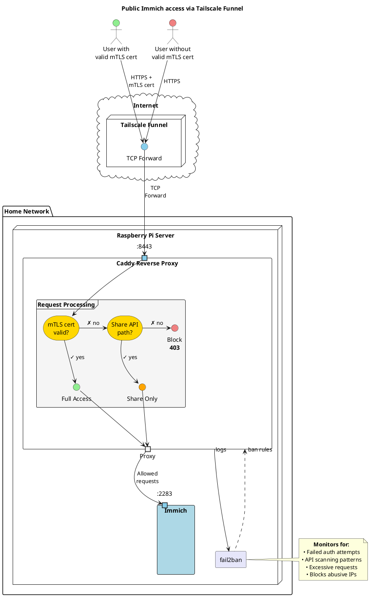

# Plantuml diagrams

## Data flow diagram

```plantuml
rectangle "home network" {
	storage "encrypted external storage" as storage {
		database "immich\ndatabase" as db
		collections "immich\ndata" as data
    folder "secrets"
	}
	
	node RPi {
		agent immich
	}

	actor "home pc"
}

actor "remote phone"
actor "remote admin"

data -[hidden]right- db
db -[hidden]right- secrets

RPi <-left-> storage : USB
RPi <-- "remote admin" : tailscale

immich <--> "remote phone" : tailscale
immich <-> "home pc" : "immich.local:2283"

cloud "encrypted\ncloud\nstorage" as cloud
data --> cloud : rclone/\nrustic
```

## Exposed immich data flow diagram

