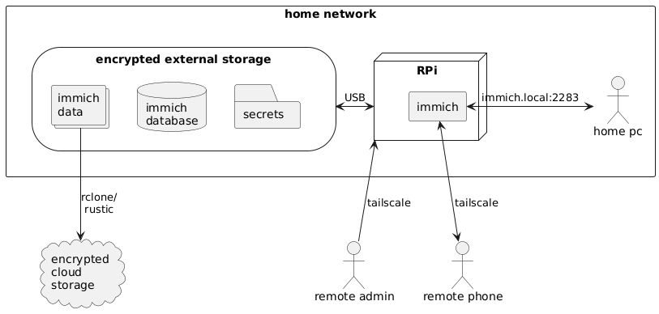

# The big picture

The diagram below describes the architecture of the immich RPi server and how different parts of the system communicate.

## Glossary

- **[Raspberry Pi (RPi)](https://www.raspberrypi.com/)**: A small and cheap single-board computer.
- **Immich**: The code that runs on the RPi providing photo management features.
- **External drive**: A Solid State Drive (SSD) or Hard Disk Drive (HDD) with a USB interface.
- **Cloud storage**: A storage service provided by third parties such as Proton Drive, Backblaze, GCP, AWS, etc.
- **`rclone`/`rustic`**: Programs that facilitate backups to cloud storage.
- **`tailscale`**: VPN that allows the server to be reachable from anywhere.
