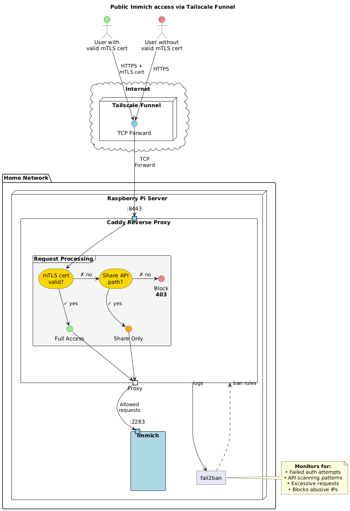

# Expose Immich to the internet

This chapter describes how to securely expose immich to the internet. This specific setup addresses two main issues with the main tailscale VPN solution:
1. Sharing photos through share links with devices not on the tailscale network.
2. Accessing immich without tailscale VPN; required to work with privacy VPNs on devices limited to one VPN instance, such as Android phones.

To enable these features securely, we will hide immich behind caddy, a reverse proxy. Caddy will only grant full server access to trusted devices with valid mTLS certificates. Caddy will allow untrusted devices to only access the share APIs. Caddy access logs will be monitored for failed login attempts and API scanning by fail2ban. Offending IPs will be banned.

> [!CAUTION]
> Media shared through a share link can be accessed by anyone. Make sure to protect these share links with passwords when generated. You can manage shared links in Sharing > Shared links.

> [!IMPORTANT]
> Exposing immich to the internet inherently adds risk. This solution introduces as number of measures to mitigate these risks. If you choose to deviate from this setup, it's important to understand how these measures work together to enable secure modifications.

## The architecture



### Glossary

- **Tailscale funnel**: A tailscale service that exposes the device URL to the public internet and forwards HTTPS requests to the device.
- **Caddy**: A reverse proxy service, filtering requests to the server.
- **Fail2ban**: Banning service. Bans abusive IPs.
- **mTLS**: Mutual TLS, enables mutual authentication between a client and a server.

## Setup

### 1. Initial prep

1. Export the certificate directory for use the the following commands.
   ```bash
   export CERT_DIR="/var/lib/certs"
   ```
2. Create the certificates directory:
   ```bash
   sudo install -d -m 755 -o $USER -g users $CERT_DIR
   ```

### 2. Server certificate

A server certificate allows secure HTTPS communication. We will use Let's Encrypt server certificates generated by tailscale to avoid browser warnings caused by self-signed certs.

1. Enable Let's Encrypt certificate generation in tailscale: Dashboard > DNS > HTTPS Certificates > Enable HTTPS.
2. Download the certs from tailscale:
   ```bash
   sudo tailscale cert \
     --cert-file $CERT_DIR/cert.pem \
     --key-file $CERT_DIR/key.pem \
     $(tailscale status --json | jq -r '.Self.DNSName' | sed 's/\.$//')
   ```

### 3. Create a Certificate Authority (CA)

Create a certificate authority on the immich server that will generate mTLS certificates for trusted devices.

1. Generate a private CA key:
   ```bash
   openssl genrsa -out $CERT_DIR/ca-key.pem 4096
   ```
2. Generate a self-signed CA certificate:
   ``` bash
   openssl req -new -x509 -days 3650 \
     -key $CERT_DIR/ca-key.pem \
     -out $CERT_DIR/ca-cert.pem \
     -subj "/CN=Immich Client CA/O=Personal/C=US"
   ```

### 4. Enabled nix configuration

The reverse proxy, caddy, it's filters and fail2ban described above are all preconfigured in the `expose-immich.nix` configuration file.

1. Go to the `improts` section of `configuration.nix`, comment out `./lan-immich.nix` and comment in `./expose-immich.nix`.
2. `sudo nixos-rebuild switch`
3. Set owner of the certs directory to caddy.
   ```bash
   sudo chown -R caddy:caddy $CERT_DIR
   ```

### 5. Open sever to the internet

Now that all the routing and filtering is configured, we can expose our server to the internet. Setup a tailscale funnel to forward raw TCP requests to caddy on port 8443.

```bash
sudo tailscale funnel --bg --proxy-protocol 1 --tcp 443 tcp://localhost:8443
```

> [!NOTE]
> This setting is persistent across reboots. To turn off the tailscale funnel you can use `sudo tailscale funnel reset`

### 6. Generate Client Certificates

Generate mTLS client certificates for trusted devices such as a personal computer or phone. This will grant them full access to immich. The `expose-immich` nix configuration provides a helpful script to generate these certificates.

```bash
sudo gen-mtls-certs --client-name <client-name>
```

This will generate
- **\<client-name\>.crt**: Client certificate
- **\<client-name\>.key**: Client private key
- **\<client-name\>.p12**: PKC12 bundle, required for phones and browsers

### 7. Install mTLS certs on your devices

#### Immich app

1. Transfer the generate `.p12` file to you phone.
2. ...

#### Browser

Assuming a chrome based browser such as brave, chrome ect.

1. Add .p12 cert to you browser at `brave://certificate-manager/clientcerts/platformclientcerts`.
2. Access your server using the tailscale URL and select the certificate when prompted.


## Monitor

The following are some helpful commands to monitor the system.

### Caddy

- Caddy access logs can be found at `/var/log/caddy/`.
- For caddy service logs use `journalctl -eu caddy -f`


### Fail2ban

- For fail2ban service logs use `journalctl -eu fail2ban -f`
- For general fail2ban status summary: `sudo fail2ban-client status`
- For jail status summary: `sudo fail2ban-client status <jail>`. `<jail>` can be one of `not-found`, `unauthorised` or `forbidden`.
- To unban an ip `sudo fail2ban-client set <jail> unbanip <ip>`
